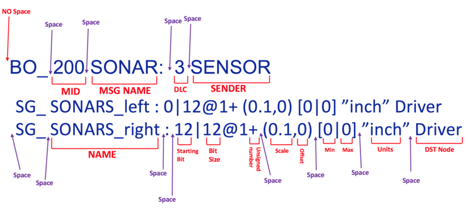

# DBC 简述和数据表示形式

## 简述

### 表达形式

`<...>` ： 必须内容

`[...]` ： 可选内容

`|`： ‘或者’, 多个内容

### 关键词

* `VERSION`： 当前DBC版本

  常见形式：`VERSION	"<Version Identifier>"`

* `BS_`：BUS 配置信息

  如： `BS_: <512>` ，总线速度为512 kb/s

* `BU_`： 所有 CAN-Node

* `BO_`： Message

  定义： `BO_ <MSG-ID> <MSG-NAME>: <MSG-Length> <Sending-Node>`

  * MSG-Length: bytes

* `SG_`：Signal

  定义：`SG_ <SignalName> [M|m<Multiplexer-Identifier>] : <StartBit>|<Length>@<Endianness><Signed> (<Factor>,<Offset>) [<Min>|<Max>] "[Unit]" [ReceivingNodes]`

  * Length: bits
  * Signed: `+` = unsigned, `-` = signed
  * Endianness: `1` = little-endian, `0` = big-endian(Motorola)
  * M：多路复用标志
  * Multiplexer-Identifier：仅当多路复用器信号的值等于该值时才使用信号定义

* `CM_`： 备注信息

* `BA_DEF`：属性定义

  如： `BA_DEF_ [BU_|BO_|SG_] "<AttributeName>" <DataType> [Config];`

| DataType | Description    | Config format              |
| -------- | -------------- | -------------------------- |
| INT      | integer        | `<min> <max>`              |
| FLOAT    | floating point | `<min> <max>`              |
| STRING   | string         |                            |
| ENUM     | enumeration    | `"<Value0>","<Value1>"...` |

* `BA_DEF_DEF_`：属性定义的对应值

  如： BA_DEF_DEF_ "<AttributeName>" ["]<DefaultValue>["];

* `BA_`：属性

  如：`BA_ "<AttributeName>" [BU_|BO_|SG_] [Node|CAN-ID] [SignalName] <AttributeValue>;`

* `VAL_`：Signal 值定义

  如：`VAL_ <CAN-ID> <SignalsName> <ValTableName|ValTableDefinition>;`

* `VAL_TABLE_` ：Signal 值 定义表

  如： `VAL_TABLE_ <ValueTableName> <ValueTableDefinition>;` 

* `GenMsgSendType`：定义消息的发送类型

  支持类型：

  * cyclic  
  * triggered  
  * cyclicIfActive  
  * cyclicAndTriggered  
  * cyclicIfActiveAndTriggered  
  * none 

  如： `BA_DEF BO_ "GenMsgSendType" ENUM "cyclic","triggered","cyclicIfActive","cyclicAndTriggered","cyclicIfActiveAndTriggered","none"` 

  其中默认值为0,

  定义： `BA_DEF_DEF "GenMsgSendType" "none"`

* `GenMsgStartDelayTime` ：定义消息的循环时间（以毫秒为单位）， 默认值 0

  如： `BA_DEF BO_ "GenMsgCycleTime" INT 0 0` 

  如: `BA_DEF_DEF "GenMsgCycleTime" 0`  

* `GenMsgDelayTime`：定义消息的允许延迟（以毫秒为单位）， 默认值为0

  如：`BA_DEF BO_ "GenMsgDelayTime" INT 0 0`

  如：`BA_DEF_DEF "GenMsgDelayTime" 0` 

* `GenSigStartValue`:只要没有为此信号设置/接收任何值，就定义该值， 默认值为0.

  如：`BA_DEF SG_ "GenSigStartValue" INT 0 0`

  如：`BA_DEF_DEF "GenSigStartValue" 0`

## DBC对应表单or数据库表

### 核心表单

#### Message

* name
* id
* length
* sender
* send_type
* is_cycle
* cycle_time
* signals
* signal_groups

#### Signal

* name

* start

* length

* byte_order

* is_signed

* scale

* offset

* unit

* min

* max

* receivers

  